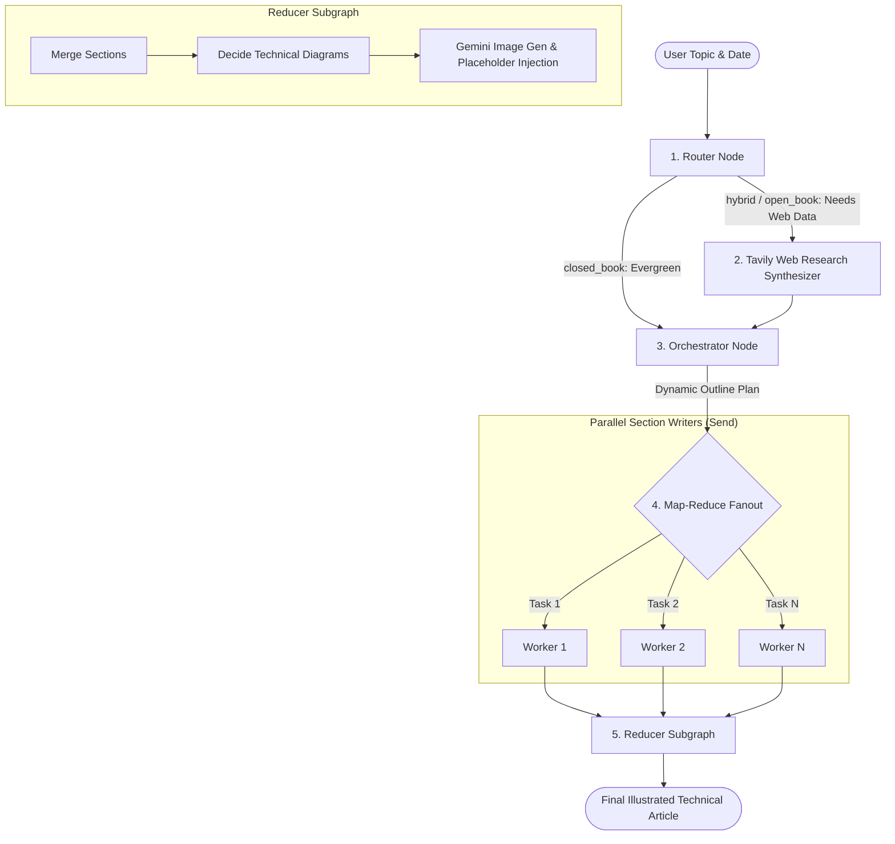

# Blog-Generating-Agent: Hierarchical Multi-Agent Technical Writer

A production-grade, multi-agent content generation system built with **LangGraph**, **Tavily Web Search**, and **Google Gemini Multimodal AI**. It features autonomous closed-book/open-book routing, live web research synthesis, dynamic task decomposition, parallel map-reduce worker fanout, and automated technical diagram/image placement.

---

## Architecture Overview



---

## Key Features

- **Autonomous Routing Classifier (`router_node`):** Classifies requests into `closed_book` (foundational concepts), `hybrid` (concepts needing fresh ecosystem examples), or `open_book` (rapidly evolving tech news/breakthroughs) with automated recency window cutoffs.
- **Evidence-Grounded Research Synthesizer (`research_node`):** Orchestrates **Tavily Search API** queries, normalizes publication metadata, deduplicates evidence URLs, and enforces strict citation grounding.
- **Dynamic Task Orchestrator (`orchestrator_node`):** Decomposes topics into structured `Plan` schemas containing 5–9 sub-tasks, section goals, bullet constraints, word counts, and citation/code requirements.
- **Parallel Fanout Worker Execution (`worker_node`):** Utilizes `langgraph.types.Send` to concurrently dispatch sub-tasks to isolated section writers, accelerating full article generation.
- **Multimodal Reducer Subgraph (`reducer_graph`):** Concatenates sections, evaluates where diagrams clarify architecture, generates imagery via **Gemini 2.5 Flash Image**, and replaces Markdown placeholders seamlessly.
- **Interactive Streamlit Dashboard:** Complete web UI (`bwa_frontend.py`) for topic configuration, mode selection, live streaming progress, and Markdown export.

---

## Tech Stack

- **Framework & Agent Orchestration:** LangGraph (`StateGraph`, `Send`, subgraphs), LangChain Core, LangChain Google GenAI
- **LLM Models:** Google Gemini (`gemini-2.5-flash`, `gemini-2.5-flash-image`)
- **Web Search & Research:** Tavily Search API (`TavilySearchResults`)
- **Schema & Data Contracts:** Pydantic v2
- **Frontend / UI:** Streamlit

---

## Getting Started

### 1. Prerequisites
- Python 3.10+

### 2. Installation

```bash
git clone https://github.com/Ayyan119/Blog-Generating-Agent.git
cd Blog-Generating-Agent

python3 -m venv .venv
source .venv/bin/activate
pip install -r requirements.txt
```

### 3. Environment Setup

Create a `.env` file with your API keys:

```env
GOOGLE_API_KEY=your_gemini_api_key
TAVILY_API_KEY=your_tavily_api_key
```

### 4. Running the Application

**Run via Streamlit Frontend:**
```bash
streamlit run bwa_frontend.py
```

**Run via Python Backend Graph:**
```bash
python bwa_backend.py
```

---

## Repository Structure

```text
Blog-Generating-Agent/
├── bwa_backend.py                  # LangGraph multi-agent orchestration engine & schemas
├── bwa_frontend.py                 # Streamlit interactive UI
├── requirements.txt                # Python dependencies
├── 1_bwa_basic.ipynb               # Baseline single-agent experiments
├── 2_bwa_improved_prompting.ipynb  # Prompt engineering iterations
├── 3_bwa_research.ipynb            # Tavily search integration
├── 4_bwa_research_fine_tuned.ipynb # Evaluation and tuning experiments
└── 5_bwa_image.ipynb               # Gemini multimodal image generation pipeline
```

---

## License

MIT License.
